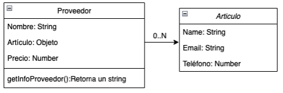

## PROBLEMA

Gastronomía Market es una empresa que se dedica a proveer productos e insumos
gastronómicos a distintos restaurantes. Esta empresa requiere el desarrollo de un
programa realizado en JavaScript, que permita hacer seguimiento de sus productos, sus
precios y sus proveedores.

Para cumplir el requerimiento del cliente se debe generar:

1. Un objeto Proveedor, el cual debe tener un nombre, un artículo y un precio.
2. Un objeto Artículo, el cual debe tener un nombre, email y teléfono. Además, debe
contar con un método que devuelva un mensaje con el nombre y teléfono del
proveedor llamado getInfoProveedor(). Para generar estos objetos se deben definir
una clase Proveedor y otra clase Artículo.

    De esta forma el esquema quedaría de la siguiente forma:

    

El cliente además solicita que su código contemple las mejores prácticas y estándares
posibles, por tanto, se solicita que su realización sea en base a ES6.

## REQUERIMIENTOS

1. Mantén un estilo de código (espacios, saltos de línea, indentación) uniforme en el
proyecto. (1 punto)
2. Utilizar ES6 para el desarrollo de todo el programa, incluyendo let y const para la
declaración de variables. (2 puntos)
3. Utilizar arrow functions para las funciones. (1 puntos)
4. Implementar los objetos Proveedor y Artículo utilizando clases ES6. (1 puntos)
5. Implementar getter y setter para acceder y/o modificar los datos de las clases. (2
puntos)
6. Utilizar el operador spread para copiar o combinar objetos o arrays donde sea
necesario. (1 punto)
7. Crear y exportar las clases desde módulos JavaScript y luego importarlas en un
archivo main.js. (1 punto)
8. Implementar una función que permita calcular el impuesto total a pagar por parte
de un cliente, que reciba como parámetro un objeto Proveedor. (1 punto)